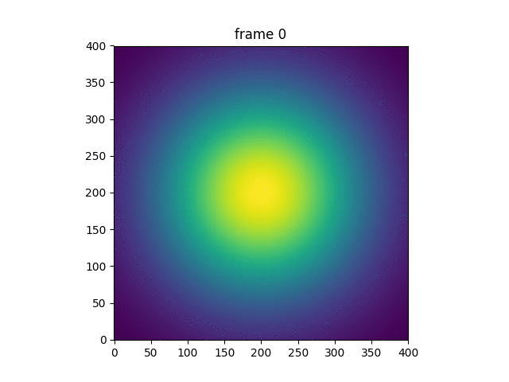
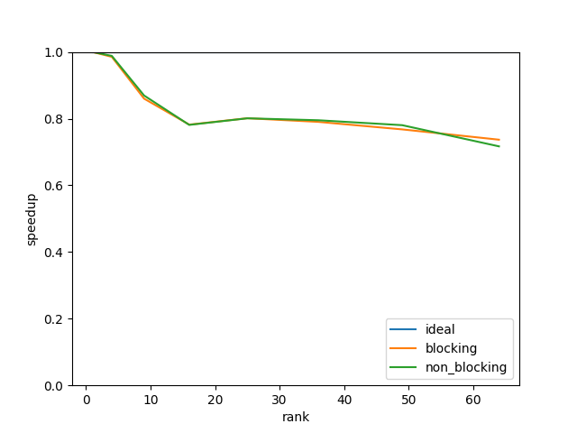

# 1. Ploting
# 1.1. Run code and compare
Run 2 commands:     

    mpirun -n 1 ./main 2000 400 1.0 1.0e3 5.0e-7 2.85e-7 1 serial
    mpirun -n 16 ./main 2000 400 1.0 1.0e3 5.0e-7 2.85e-7 1 mpi_blocking

And compare 2 output files:
    
    python compare.py 

It returns '0', which means all values in 2 matrice are equal.      
P.S. Due to the precision, values are not 'identical' but have an error around 10^-15 to 10^-17. My compare script will count if error is larger than 10^-10.

# 1.2.
Serial:      
     

Mpi:      
   

View animations in `./fig/`

# 2. Strong Scaling Study

Mode | mpi_blocking | mpi_non_blocking | openmp
-- | --- | --- | ---
Time(ms) | 9159 | 9086 | 11563

Non-blocking and blocking case performance almost the same in the case. All ranks are very balanced and sync function is small, so the advantage of blocking seldom shows here.

# 3. Weak Scaling Study

# 4. Hybrid mode
Mode | 16 rank | 4 rank * 4 thread | 16 thread
-- | --- | --- | ---
Time(ms) | 72508 | 82907 | 207588

When in openmp mode, program needs duplicate matrix for threads, which increases square with dimension(N). The overheads will increase largely.     
However, in mpi case, the size of ghost cells only increases linearly.      
So using MPI is a better choice.