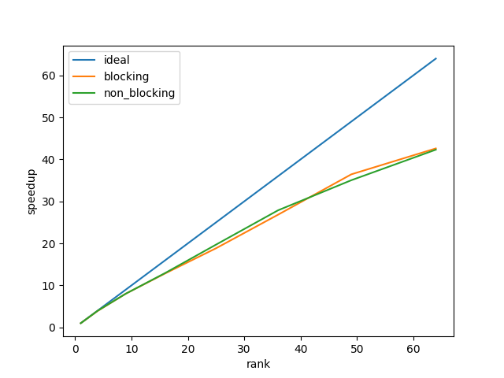

# 1. Example ploting
Running args: ./serial 400 20000 1.0 1.0e6 5.0e-7 2.95e-7       
View animation in fig folder(./fig/serial.gif)      

# 2. OpenMP Thread Scheduler Performance
Running args: ./parallel 3200 2000 1.0 1.0e3 5.0e-7 2.95e-7 4       

Scheduler | guided | dynamic | static(default size= 800) | static,10 | static,50
--- | --- | --- | --- | --- | ---
RunningTime/s| 252.9 | 255.2 | 255.2 | 257.0 | 257.9

Generally, guided mode is faster than dynamic than static. Larg chunksize is faster than small size. However, they perform similarly in this project because
because every thread is statisticly balanced and costs the same time.       
P.S. For all performance analyse part, I delete IO operations in my program, which is slow and unparallelable.

# 3. Strong Scaling Study

As shown in fig, speedup is less than ideal. In addition, performance in large matrix is better. The reason may be thread overheads. As parallel size becomes larger, the portion of overheads diminishes.

# 4. Weak Scaling Study

Efficiency decreases when number of threads increases. Possible reason is that threads interacts with each other, e.g. some neighbors may being visited by other threads so current thread have to wait to acquire the lock.