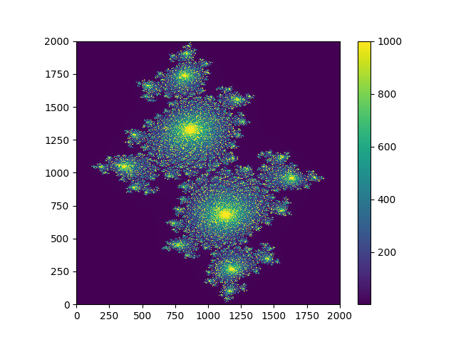
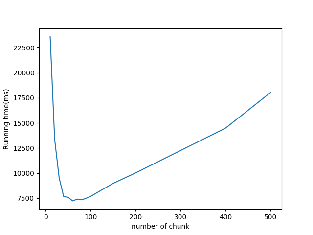
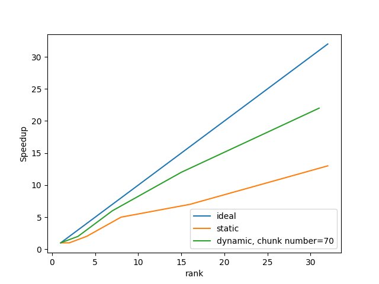

# 1 MPI Latency and Bandwidth

## 1.1 Lantency

Mode | Avg Roundtime(us)
-- | --
Intra-node | 0.56
Inter-node | 2.61

## 1.2 Bandwidth

Mode | Unit | Bandwidth(GB/s)
-- | -- | --
Intra | KB | 0.23
Intra | MB | 8.27
Intra | GB | 4.35
Inter | KB | 0.007
Inter | MB | 0.69
Inter | GB | 2.86

For intra-nodes mode, there is a peek speed between MB and GB.      
For inter-nodes mode, transmission speed increases when data size increases.    

# 2 Julia Set

## 2.1 Serial
     

## 2.2 MPI Dynamic Load Balancing
     
As shown in plot, we choose chunk number = 70 as parameter in following performance analysis.

## 2.3 Performance Analysis
      
Dynamic scheduler does much better than it does in Pset 1 because in this problem, the load of every sub problem is imbalanced, dynamic decomposition can really make use of unoccupied processors.