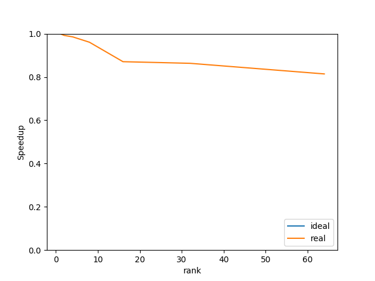

# HPC Project 4
## Jiawei Jiang

## 1. Serial Experimentation
Run a simulation of 75*75 domain.   

### 1.1 Resources used
Mehtod | Memory(MB) | Time(sec)
-- | -- | --
Dense | 241.61 | 8.52
Sparse(OTF) | 0.21 | 0.02

### 1.2 Example plotting

### 1.3 Estimations
Dense memory method will consume a memory of O(N*N), while OTF method only need O(N).(Approximately)    
If we scale the problem size ot 10000 * 10000:   
Dense memory will increase to  around 2 * 10^10 GB.   
Sparse memory will be 4 GB.

## 2. Parallel Experimentation

### 2.1 Example plotting
Here is the result of `mpirun -n 4 ./main 75 parallel`: 
 

### 2.2 Strong Scaling
     
With rank increasing, array size of each rank decreases. However, the ghost cells in each rank does not change, which reduces the parallel efficiency.

### 2.3 Weak Scaling
     
There are probably 2 reasons:   
1. The same in strong scaling. Communication overheads increase relatively.     
2. Iteration times increases when problem size increases. If we define a new "speedup" based on "running time per iteration step", we can get a more "ideal" scaling curve: 
   
