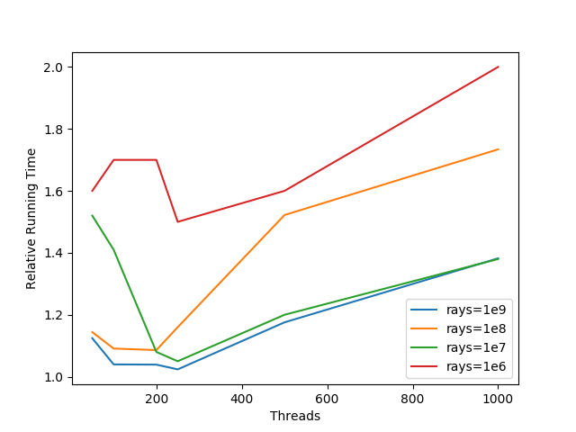
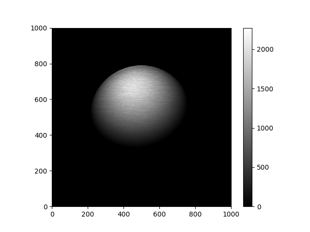

# HPC Project 5
## Cuda Ray Tracer

## 1. Experiments about thread configuration  
    

Though the data is noisy in small thread region, we can see for all numbers of rays, thread = 250 would be a good choice.

## 2. Performance Comparison
Serial code runs on cpu: Intel E5-2670.      
Cuda code runs on gpu:   Nvidia M2090.  

\#Rays | 10^3 | 10^4 | 10^5 | 10^6 | 10^7 | 10^8 | 10^9
-- | -- | -- | -- | -- | -- | -- | --
CPU time/ms | 0.9 | 8.0 | 76.9 | 718.2 | 7180.1 | 71210.1 | 713418.0
GPU time/ms | 7.7 | 4.7 | 5.8 | 14.8 | 105.2 | 1160.0 | 10234.1

1. CPU running time increases almost linearly.  
2. GPU running time increases linearly after GPU band-width is full.    
3. GPU speedup is about 70x.

## 3. Sample plotting
    