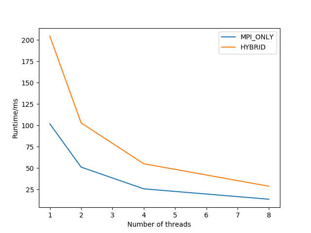
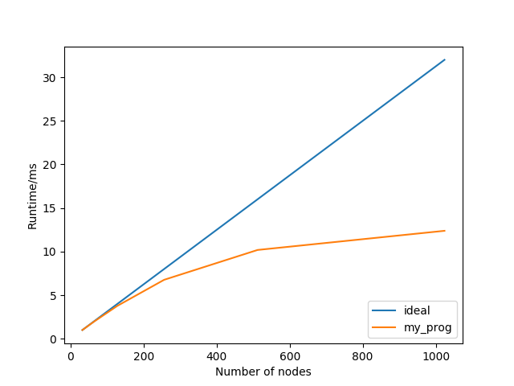

# HPC Project6
## Nbody problem

## 1. Interesting Initial Conditions
A spiral elliptical galaxy.    
For simplification, there's some assumptions:   
1. galaxy is 2D.    
2. galaxy consists by light stars outside and a huge-mass star at center.

See video in `/figs`.
Simulation shows that the galaxy arm will quickly desperse.(If there is no substantial amount of dark matter)

## 2. Parallel MPI Implementation   
### i. Correctness
Using parameters:
```
    Number of Timesteps = 10
    Number of Bodies = 128
    Number of Max Parallel MPI Ranks = 4
    Number of Max Openmp Threads = 16
```

The output files are identical from all serial, MPI only and Hybrid parallel version.   

### ii. Basic Tests
Using parameters:
```
    Number of Midway nodes = 8
    Number of Vesta nodes = 32
    Number of Timesteps = 10
    Number of Bodies = 102,400
```

Mode | Runtime(sec)
-- | --
Midway_MPI | 13.44
Midway_Hybrid | 28.65
Vesta_MPI | 60.48
Vesta_Hybrid | 15.31
Vesta_Hybrid(w/o output) | 13.61

1. Different runing mode        
On Midway, MPI_ONLY mode is faster than Hybird mode. On Vesta, the opposite is the case. The cause is probably that communication costs are different in these two architectures.        
2. Output time      
In Vesta Hybrid test, output time is about 12.5%, which is tolerable.        
3. Power consumption        
We define Relative Performance Effiency RPE as: ``1/(Energy*time). ``      
(Both uses better mode)     
On Midway, ``RPE = 2.3e-6``     
On Vesta, ``RPE = 2.6e-6``      
Vesta is a bit more effiecnt.

### iii. Midway Strong Scaling
          
MPI_ONLY mode is always better than Hybird mode.        

### iv. Vesta Strong Scaling
         
The real speedup is not entirely satisfactory. Especially under 1024 nodes, it only speeds up a little(from 35sec to 28 sec comparing to 512 nodes).        
The probable reason is that for large file, MPI_File_seek may cost a lot because it has to seek from file head to expected offset every time.        

## 3. Production Simulation
Using parameters:
```
    Number of Vesta nodes = 1024
    Number of Timesteps = 400
    Number of Bodies = 1,048,576
```
See video in `/figs`.